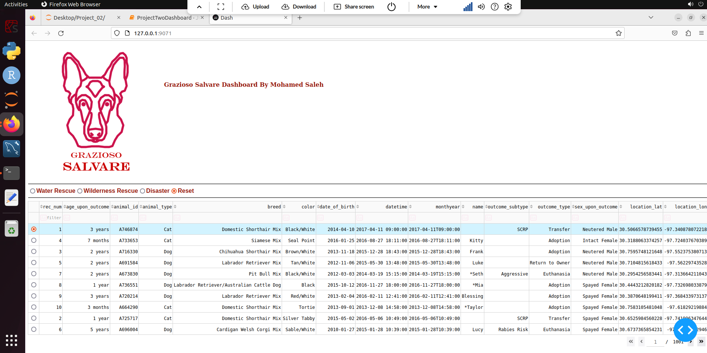
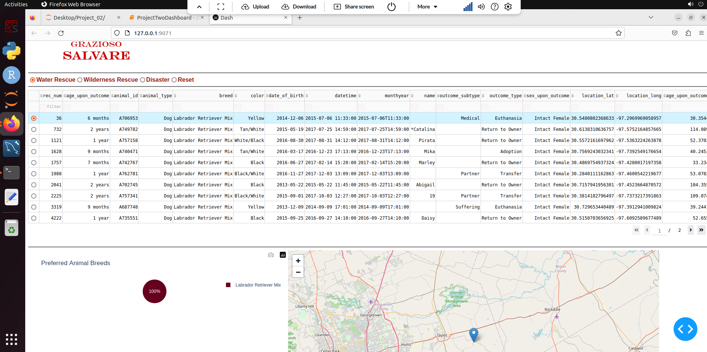
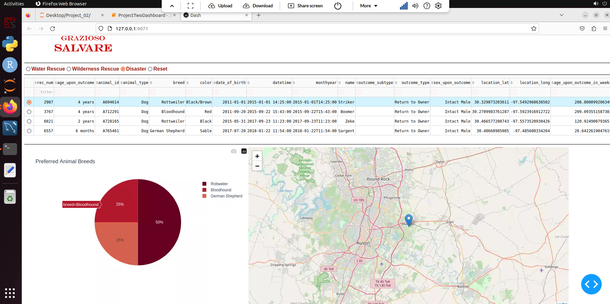
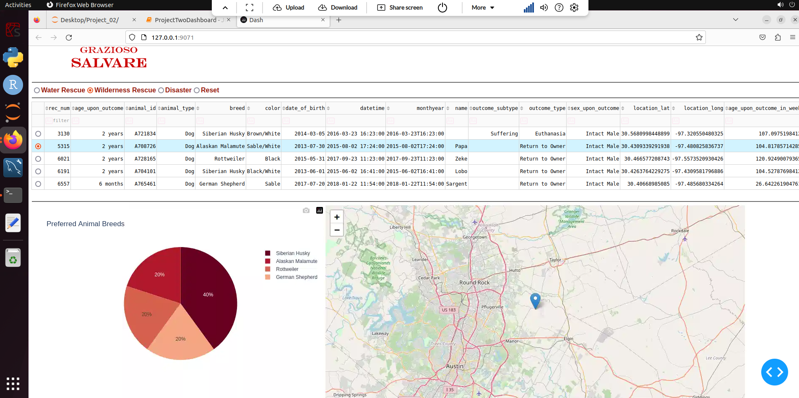

# Grazioso Salvare


## About Grazioso Salvare

Dashboard displaying animal locations and breed percentages for suitable animals selected for training.

## Motivation

Assist Grazioso Salvare in identifying rescue animals suitable for training by utilizing the Austin Animal Care database.

## Getting Started

Need to install Python3 and Mongodb and import the csv file using mongoimport. To run the test cases we need Jupyter

## Installation (Linux Env)

Please run the following command in your shell.

1. Python

```
sudo apt-get update
sudo apt-get install python3.6
```

To make sure python got installed correctly, please run the follow command.

```
python3 --version
```

2. Mongodb

```
sudo apt-get install gnupg curl

curl -fsSL https://www.mongodb.org/static/pgp/server-8.0.asc | \
   sudo gpg -o /usr/share/keyrings/mongodb-server-8.0.gpg \
   --dearmor

echo "deb [ arch=amd64,arm64 signed-by=/usr/share/keyrings/mongodb-server-8.0.gpg ] https://repo.mongodb.org/apt/ubuntu noble/mongodb-org/8.0 multiverse" | sudo tee /etc/apt/sources.list.d/mongodb-org-8.0.list

sudo apt-get update
sudo apt-get install -y mongodb-org
sudo systemctl start mongod
```

To make sure mongo got installed correctly, please run the follow command and check the status of the server

```
sudo systemctl status mongod
```

Reference: [Install MongoDB Community Edition on Ubuntu.](https://www.mongodb.com/docs/manual/tutorial/install-mongodb-on-ubuntu/#std-label-install-mdb-community-ubuntu)

3. Jupyter

```
pip install notebook
```

4. PyMongo

```
python3 -m pip install pymongo
```

5. Dash, Pandas

```
pip install dash
pip install pandas
```

## Importing

import aac.csv file to mongo database

```
mongoimport
	--username=USERNAME
	--password=PWD
	--port=34281
	--host=HOST
	--db AAC
	--collection animals
	--type csv
	--file ./aac.csv
	--headerline
	--authenticationDatabase admin
```

## Usage

By default the dashboard is set to reset showing all data.


When user selection the system will filter out the data and show the percentage of each breed for each category, select the first row in the result for the geolocation


Disaster Rescue


Wilderness Rescue


## Code Snippet

```python
##############################################
# Process User Filters
##############################################
@app.callback(
    Output('datatable-id', "data"),
    Input('rd-selection', 'value'),
)
def process_filter(selection):
    # filter object
    filterObj = {}
    #Water Rescue
    if selection == "wr":
        desiredBreeds = ["Labrador Retriever Mix","Chesapeake Bay Retriever","Newfoundland"]
        filterObj["animal_type"] = "Dog"
        filterObj["breed"] = {"$in":desiredBreeds}
        filterObj["sex_upon_outcome"] = "Intact Female"
        filterObj["$and"]=[
                            {"age_upon_outcome_in_weeks":{"$gte":26}},
                            {"age_upon_outcome_in_weeks":{"$lte":156}}
                          ]

    # Wilderness Rescue
    if selection == "wir":
        desiredBreeds = ["German Shepherd", "Alaskan Malamute","Old English Sheepdog", "Siberian Husky","Rottweiler"]
        filterObj["animal_type"] = "Dog"
        filterObj["breed"] = {"$in":desiredBreeds}
        filterObj["sex_upon_outcome"] = "Intact Male"
        filterObj["$and"]=[
                            {"age_upon_outcome_in_weeks":{"$gte":26}},
                            {"age_upon_outcome_in_weeks":{"$lte":156}}
                          ]

    # Disaster Rescue
    if selection == "dr":
        desiredBreeds = ["Doberman Pinscher", "German Shepherd", "Golden Retriever","Bloodhound", "Rottweiler"]
        filterObj["animal_type"] = "Dog"
        filterObj["breed"] = {"$in":desiredBreeds}
        filterObj["sex_upon_outcome"] = "Intact Male"
        filterObj["$and"]=[
                            {"age_upon_outcome_in_weeks":{"$gte":20}},
                            {"age_upon_outcome_in_weeks":{"$lte":300}}
                          ]

    # fetch data with filter object
    data = shelter.reading(filterObj)
    filteredDataFrame = pd.DataFrame.from_records(data)
    # remove _id
    if "_id" in filteredDataFrame.columns:
        filteredDataFrame.drop(columns=['_id'], inplace=True)

    return filteredDataFrame.to_dict('records')
```

## Contact

Mohamed Saleh

[Email Me](mailto:mohamed.saleh2@snhu.edu)

## Reference:

[Install MongoDB Community Edition on Ubuntu.](https://www.mongodb.com/docs/manual/tutorial/install-mongodb-on-ubuntu/#std-label-install-mdb-community-ubuntu)

[Pymongo 4.10.1 documentation.](https://pymongo.readthedocs.io/en/stable/)

### How do you write programs that are maintainable, readable, and adaptable? Especially consider your work on the CRUD Python module from Project One, which you used to connect the dashboard widgets to the database in Project Two. What were the advantages of working in this way? How else could you use this CRUD Python module in the future?

I began by analyzing the requirements and visualizing the primary inputs and outputs of the system. From there, I designed a clear interface that effectively translated the system requirements into functionality. I selected clear and concise names for the system functions and included extensive comments to clarify expected inputs, given Python's lack of static typing, to improve code readability. Exception handling was implemented to ensure the accuracy and reliability of every action within the system. Once development was complete, I wrote test cases to verify the software's outcomes. Developing the CRUD Python module was straightforward due to the well-defined requirements. However, I would like to add a validation layer to prevent dummy data from being added and to enhance data integrity.

### How do you approach a problem as a computer scientist? Consider how you approached the database or dashboard requirements that Grazioso Salvare requested. How did your approach to this project differ from previous assignments in other courses? What techniques or strategies would you use in the future to create databases to meet other client requests?

I typically approach problems by breaking them down into smaller components and working incrementally from the ground up. For this project, I needed to familiarize myself with both the pymongo and dash libraries. Dash, in particular, was new and intriguing because it leverages the React framework to render and handle front-end GUI and interactions. As a developer, I find dashboards to be inherently complex and time-intensive when it comes to presentation. However, Dash significantly simplifies this process by offering a wide range of building blocks that require minimal effort to implement. I would choose MongoDB for applications that require a non-relational, scalable database solution for future clients.

### What do computer scientists do, and why does it matter? How would your work on this type of project help a company, like Grazioso Salvare, to do their work better?

To enhance flexibility, I would introduce an additional layer to define rescue dogs, eliminating the need to modify the code for each new or existing rescue dog. This would involve creating a separate collection to store rescue dog criteria, which could then be dynamically rendered on the front end. Additionally, I would enable users to select multiple dogs from the grid for visualizing different selections. I would also include a dedicated panel for search criteria and display the results on a map.
