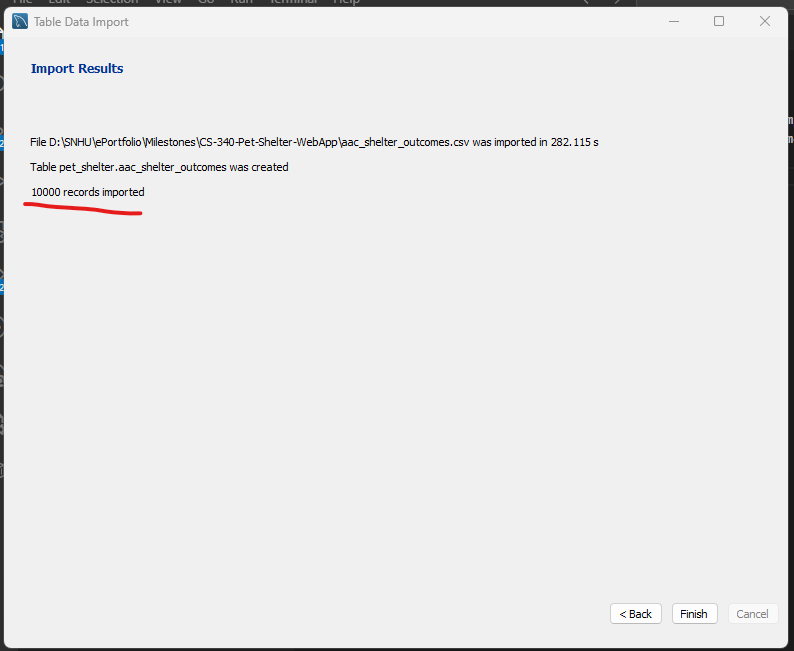

1.  Install MySQL Workbench
2. Create New Schema pet_shelter
3. Right Click on `pet_shelter` and select Table Data Import Wizard from Navigator tab
4. Select `aac_shelter_outcomes.csv` and leave table name as it is `aac_shelter_outcomes`
5. Click Next and wait until the rows are imported.
6. Click Next then finish

##### Database location
`C:\ProgramData\MySQL\MySQL Server 8.0\Data`