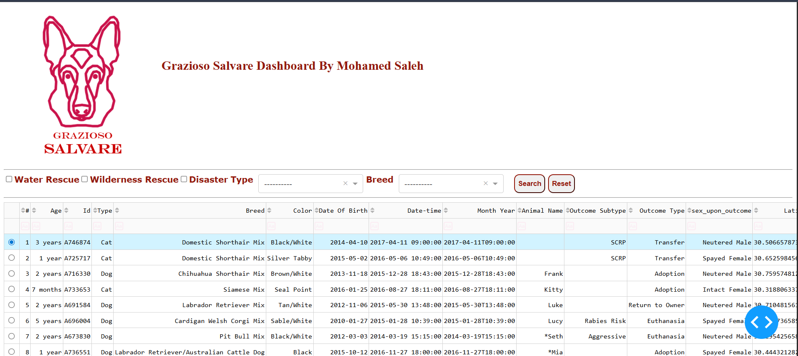
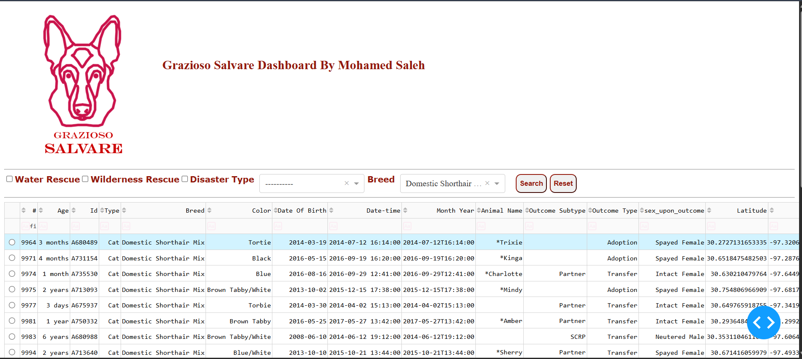

#### Import CSV file to Database

1.  Install MySQL Workbench
2.  Create New Schema pet_shelter
3.  Right Click on `pet_shelter` and select Table Data Import Wizard from Navigator tab
4.  Select `aac_shelter_outcomes.csv` and leave table name as it is `aac_shelter_outcomes`
5.  Click Next and wait until the rows are imported.
6.  Click Next then finish


#### Install Dependencies

```sh
./install.bat
```

#### Change Database Connection

Update user, password according to the MySQL Server.

```py
db_config = {
    'host': 'localhost',
    'database': 'shelter',
    'user': 'root',
    'password': '5624566'
}
```

### Run the App

```sh
./run.bat
```

##### Database Export

Update `export.bat` file with desired location to export the database.
run `export.bat`

`C:\ProgramData\MySQL\MySQL Server 8.0\Data`

```
./export.bat
```

### Screenshot

Default Dataset


Search for specific breed


Search with different criteria

