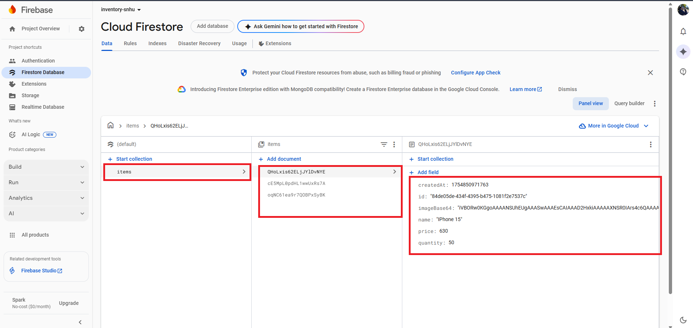
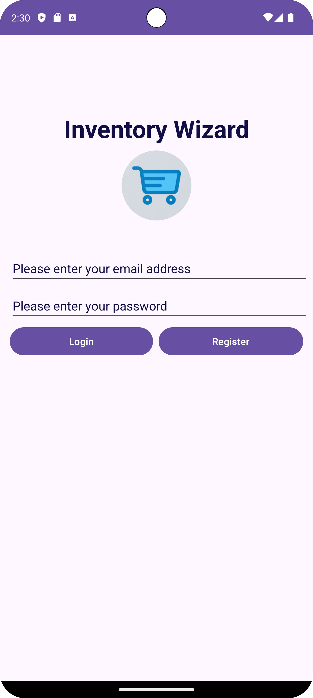

# Inventory Mobile App

#### It's a simple Android application to manage inventory. The earlier version for the app was depedning on MySQL database, which not realistic nor practical. Though, form practice prespective it was enough to maniupver around UI elements, Workflow, Database Interactions, Permissions..ect.

#### The current version is an enhanced version, where Firebase Auth was added and real-time Firebase storgae incoperated to better and scalable soltiuon. The transition from old MySQL database to Firebase wasn't a straight forward. I conducted multiple refactoring for the project to encoperate Firebase Auth, Storage.

## Firebase Auth

## Firebae Storage-database

## User Registeration

## Login

### Add/Update Item

## View Items

### Showing items on Pixel 8

### Live update on Pixel 9 to simulate real-time update on two different devices.

## Edit Item

## Delete Item

