# Code Review - URLs

[Pet Shelter](https://drive.google.com/file/d/1GxCkwqIvsBfykgex7l5zNQiMP7w5dyod/view?usp=sharing)

[Inventory Management Mobile App](https://drive.google.com/file/d/1bua3CBhjsy9YfIoyQxTFsYgaz1mPGKzG/view?usp=sharing)

# Original Artifcats

[Inventory Mobile App](./CS-360-Inventory_Mobile_App.zip)

[Pet Shelter](./CS-340-Pet-Shelter-WebApp.zip)

# New Artifacts

[Inventory Mobile App](./CS-360-Inventory_Mobile_App-NEW.zip.zip)

[Pet Shelter](./CS-340-Pet-Shelter-WebApp-NEW.zip.zip)

### Narrative for Software Engineering

#### For Artifact 01 -- Inventory Mmt Android Mobile App, The project required refactoring to remove its dependency on the MySQL database and replace it with Firebase Authentication and Firestore. I rewrote the core database functions using Firebase equivalents and implemented several UI changes to accommodate the new search functionality

#### For Artifact 02 -- Pet Shelter Dashboard App, The project required a full refactoring. To enhance modularity, the first step was to break down multiple functions into a shared class and remove the dependency on Jupyter Notebook. Additionally, a new class was introduced to handle user search parameters by converting them into SQL statements. To streamline the UI controls, state callbacks were consolidated.

### Narrative for Database

#### For Artifact 01 -- Inventory Mmt Android Mobile App, Enhancing the Mobile App Database: A Challenging Transition to Firebase The database enhancements for the mobile app presented several challenges, particularly in migrating from a MySQL database to Firebase and replacing the existing authentication system with Firebase Auth. Below is a breakdown of the key steps I followed:

1. #### Google Console Setup
   #### To enable Firebase Storage and Authentication, I first configured the project in Google Console, linking the app to Google Services and activating the desired authentication method. This involved downloading the google-services.json file and integrating it into the project.
2. #### Updating Dependencies

   #### Next, I modified the Gradle files (Android’s build system) to include the necessary Firebase dependencies for Auth and Storage.

3. #### Implementing Code Changes
   #### Helper Class Development: I created a singleton-pattern helper class to manage Firebase service references efficiently.

#### LoginActivity Refactor: Removed the InventoryDatabase dependency and restructured onCreate() to use Firebase Auth for login functionality.

#### RegisterActivity Update: Refactored the registration logic to integrate Firebase Auth, handling error responses from Google services.

#### AddItemActivity Adjustments: Modified the implementation to store product images in Base64 (since Firebase doesn’t support raw byte storage) and ensured proper conversion when retrieving images.

#### InventoryActivity Overhaul: Updated all functionalities to align with Firebase’s real-time database structure.

4. #### Testing & Debugging
   #### Testing on a physical device proved difficult due to API version conflicts. To resolve this, I set up multiple virtual devices to thoroughly validate live updates and ensure seamless functionality.

#### For Artifact 02 -- Pet Shelter Dashboard App, the database upgrades were straightforward to implement. I set up a new MySQL database and imported the updated CSV file, ensuring the first column was labeled with '\_id' to prevent any unnamed columns in the table structure.

#### Additionally, I documented all necessary setup steps in the README.md file for future reference. I also made several UI improvements to enhance the overall presentation and user experience.

### Narrative for Algorithms and Data Structure

#### For Artifact 01 -- Inventory Mmt Android Mobile App,I developed a new function that captures user selections as key-value pairs in a dictionary and dynamically constructs the corresponding SQL query. Coming from a SQL Server background, I wasn’t accustomed to wrapping SQL statements in brackets, but MySQL required this adjustment. To handle this, I pre-defined a list of potential SQL statements and modified them based on their length—adding brackets and the UNION keyword where necessary—to ensure the final result set accurately reflected the user’s selections. The search criteria were simpler, primarily involving the addition of a new text input field. I linked this input to the Adapter class to filter item names based on user input, which required significant logic adjustments in the Adapter to support the new functionality.

#### For Artifact 02 -- Pet Shelter Dashboard App, I completely overhauled the entire codebase, migrating from outdated dependencies to a MySQL database and reimplementing all functionalities from scratch. The process was quite challenging. The first major hurdle was the project's reliance on Jupyter Notebook. Due to compatibility issues with old dependencies, I had to transition the entire implementation to standalone Python files. After overcoming this, I successfully got the project running—only to discover numerous broken components, including images, maps, and other elements. I also identified duplicate control IDs, which caused parsing errors in the browser when rendering component properties. After resolving these issues, I refactored the code by breaking down large sections into separate classes for better modularity and readability.Additionally, I introduced a new dropdown list for search functionality, replaced radio buttons with checklists, and began rewiring all controls and callback functions to accommodate the updated user inputs.


### Professional Assessment

I am a computer programmer with a deep interest in problem-solving, building innovative tools, and developing systems. I thrive on learning new technologies and applying them to create efficient solutions.

### Key Skills & Expertise
Desktop Application Development: Built multiple desktop solutions for various business domains using .NetCore.NET, C#, Framework and Microsoft Dynamics.

Frontend Development: Developing Single-Page Applications (SPAs) using modern frameworks like React, Vue.js, and StencilJS.

Reverse Engineering & Assembly: Enjoy exploring low-level programming and reverse engineering using tools like IDA Pro, GDB, OllyDbg, and SPY++.

Constantly expanding my knowledge and exploring new technologies to stay ahead in the ever-evolving tech landscape.

### Technologies
C#, .Net Core, ASP.NET MVC, IIS, Windows Forms, .Net Framework 4.8, REST API, JavaScript, Vue.JS, ReactJS, TypeScript, StencilJs, AzureDevOps CI/CD, Yaml, Handlebars, TSQL, Docker, Microservices, Git, DevExpress, Mermaid, Handlebars, JWT, WebHooks, SignalR, ELK, X++ Language, AOT, MS SQL Server, SSRS, SAP Crystal Reports, Visual Basic 6.0, TFS, Windows Services, JSON, SOAP, Infragistics, DevExpress, LLBLGen 2.4, Win32 API, C/C++ Language, Micro-C, Arduino, OpenGL, ActionScript 3, Shell and Python

## Lastest Projects

[Scalable Geolocation Citibike Assignment - C#](https://github.com/mohamedsaleh1984/MP_System)

[Duplicate Files Finder - C++17](https://github.com/mohamedsaleh1984/duplicate-files-finder)🔥Active Development

[Chrome Extension - JS](https://github.com/mohamedsaleh1984/deep-seek-2-pdf)

- 🔭 I’m currently working on search engine to replace windows search bar (COM+, Backend services, Indexing, Tokenizer..etc) 
- 🌱 I’m currently learning about Azure/AWS

### Certificates
[Microsoft Certified: Azure Fundamentals-2025](./certs/AZ-900.pdf)

[Certified ScrumMaster-2025](./certs/Certified%20ScrumMaster%20(CSM).pdf)

[Agile Course Completion-2025](./certs/Course%20Completion%20Certificate-upGrade.pdf)

[Master in Computer Science-2022](./certs/MS.c%20CS.pdf)

[Android Developer Track-2018](./certs/UDA.pdf)

[Software Project Managment-2016](./certs/SPM.pdf)

[Snap-In Development Specialist-2016](./certs/SNAP.pdf)

[Into to Agile Software Development-2016](./certs/AG.pdf)

[Agile Foundation-2016](./certs/Agile%20Exam.pdf)

[In Dealing with Difficult People-2016](./certs/HMG-1.pdf)

[In Art of Listening-2016](./certs/HMG-2.pdf)

[Mastering Java-2009](/certs/YAT-2.pdf)

[Electronics-2009](./certs/ELEC.pdf)

## Artifact 01 - Pet Shelter - README

### View and Search rescue pets based on different criitera from a 10k data set and view where the pet is located

### Import CSV file to Database

1.  Install MySQL Workbench
2.  Create New Schema pet_shelter
3.  Right Click on `pet_shelter` and select Table Data Import Wizard from Navigator tab
4.  Select `aac_shelter_outcomes.csv` and leave table name as it is `aac_shelter_outcomes`
5.  Click Next and wait until the rows are imported.
6.  Click Next then finish

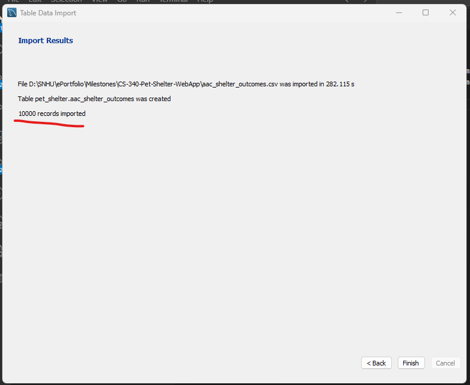

### Install Dependencies

```sh
./install.bat
```

### Change Database Connection

Update user, password according to the MySQL Server.

```py
db_config = {
    'host': 'localhost',
    'database': 'shelter',
    'user': 'root',
    'password': '5624566'
}
```

### Run the App

```sh
./run.bat
```

##### Database Export

Update `export.bat` file with desired location to export the database.
run `export.bat`

`C:\ProgramData\MySQL\MySQL Server 8.0\Data`

```
./export.bat
```

### Screenshot

Default Dataset
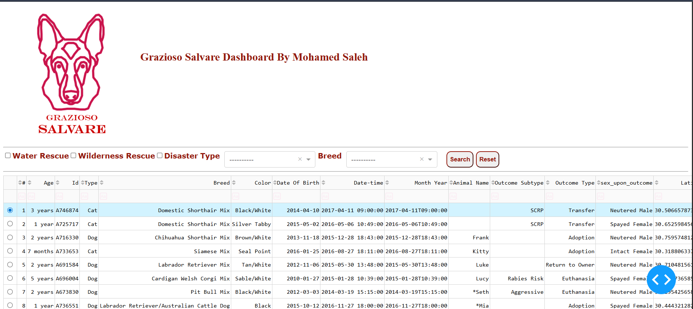

Search for specific breed
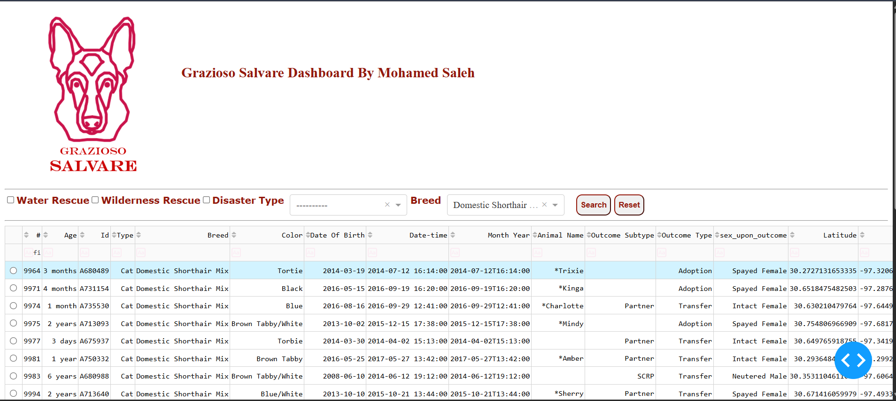

Search with different criteria


## Artifact 02 - Inventory Mobile App - README

#### It's a simple Android application to manage inventory. The earlier version for the app was depedning on MySQL database, which not realistic nor practical. Though, form practice prespective it was enough to maniupver around UI elements, Workflow, Database Interactions, Permissions..ect.

#### The current version is an enhanced version, where Firebase Auth was added and real-time Firebase storgae incoperated to better and scalable soltiuon. The transition from old MySQL database to Firebase wasn't a straight forward. I conducted multiple refactoring for the project to encoperate Firebase Auth, Storage.

## Firebase Auth

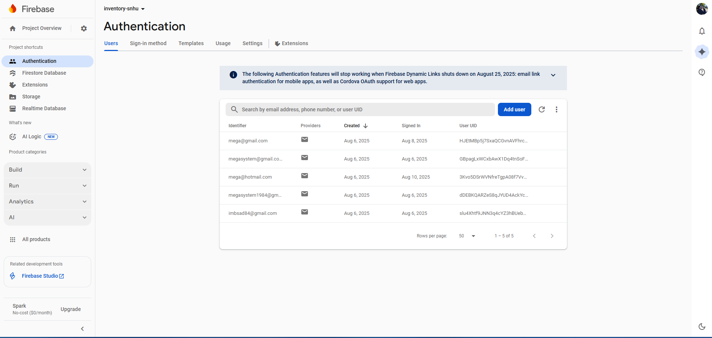

## Firebae Storage-database

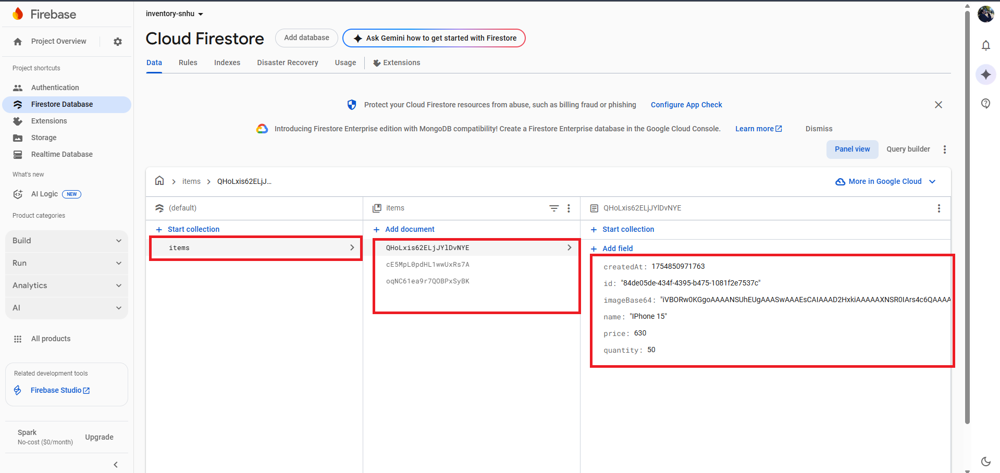

## User Registeration

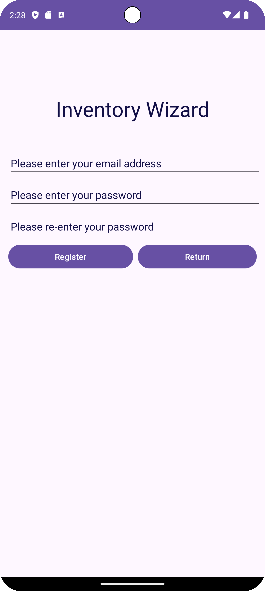

## Login

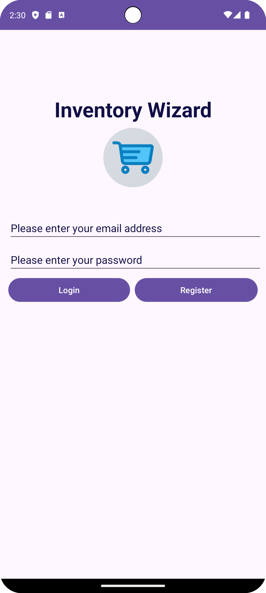

### Add/Update Item

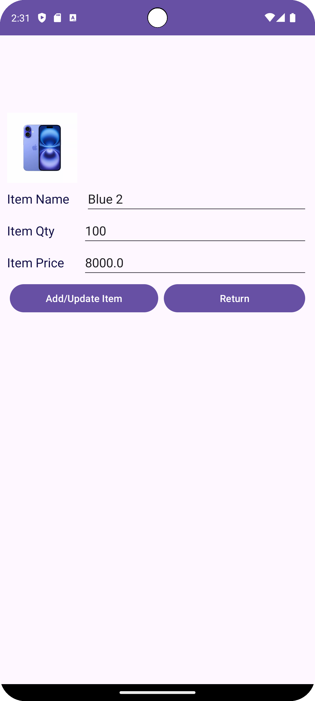

## View Items

### Showing items on Pixel 8

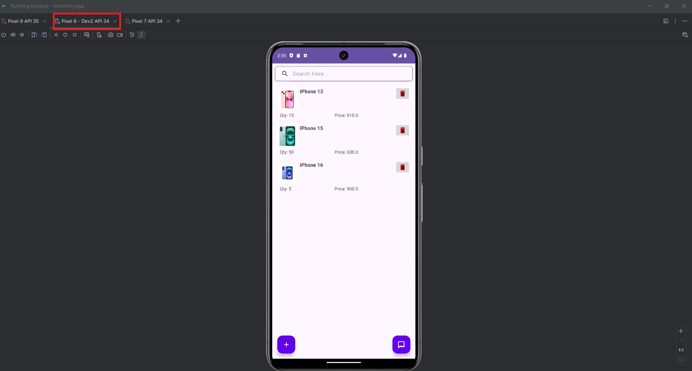

### Live update on Pixel 9 to simulate real-time update on two different devices.

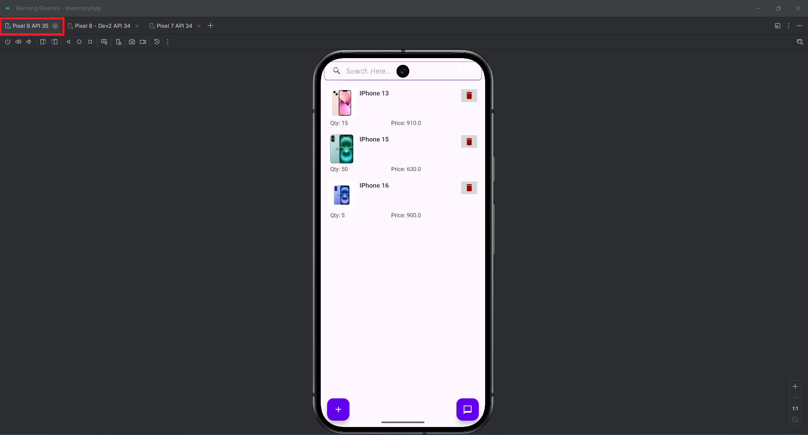

## Edit Item

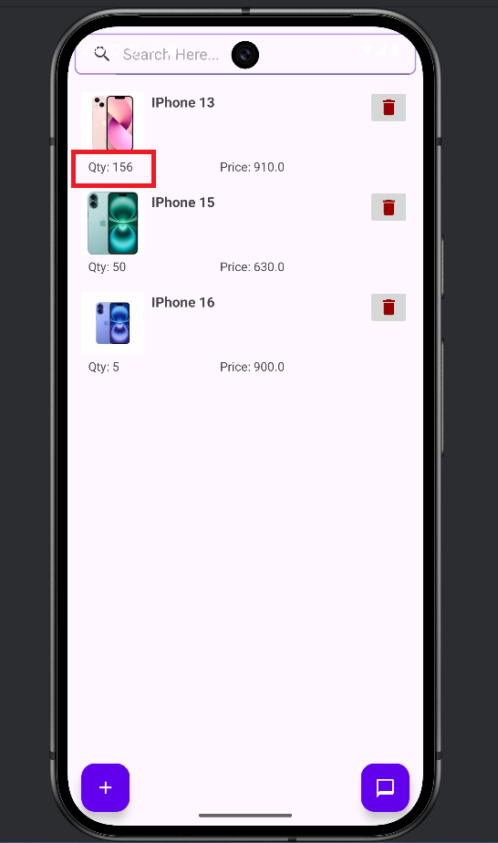

## Delete Item

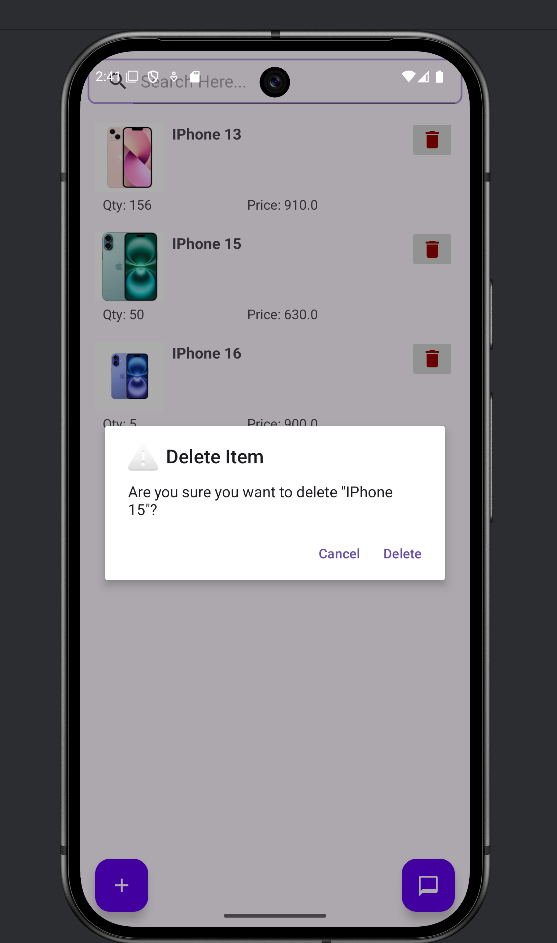

For more information please contact

Software Engineer: [Mohamed Saleh](mailto:mohamedsaleh1984@hotmail.com)
